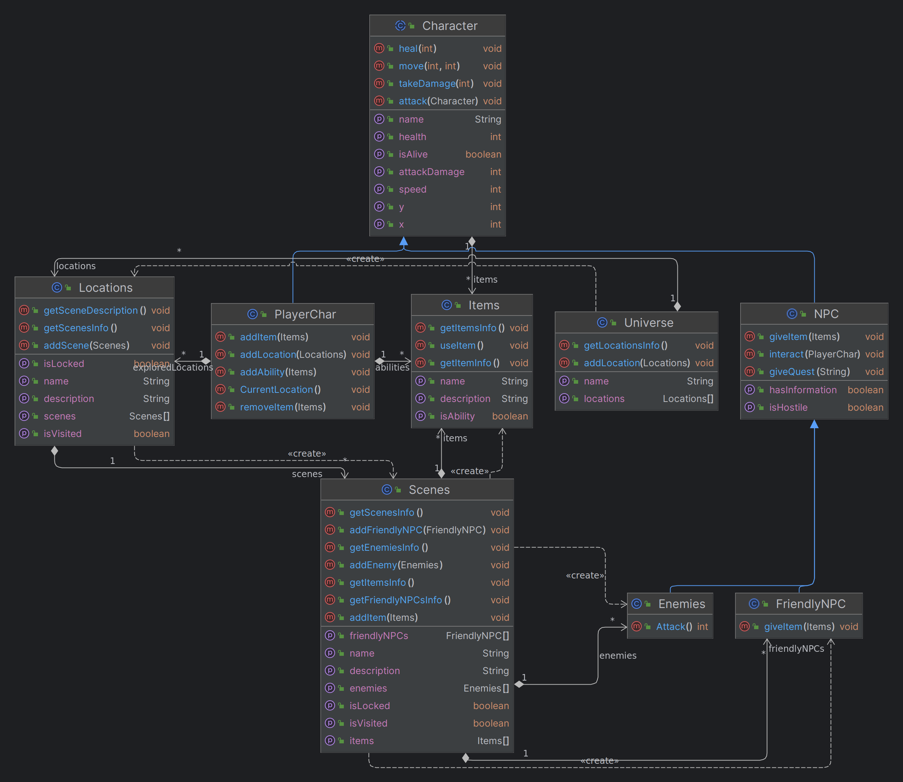

## Téma a vize projektu:
Whispering Woods: The Tree of Life
Svět už roky umírá, před spoustou lety přišel vlk z dáli a od té doby sužuje celý stenající les. Otrávil
jeho vody a znehodnotil jeho zeminu, má tak totiž moc nad oním lesem, a může ho mučit, tak jako
jeho myšlenky na jeho ztracenou dcera, která zmizela v těchto lesích.
Mezi bytostmi, které obývají stenající les panuje legenda, ta praví, že jednoho dne má přijít
následník duší lesa, a ten má vlka vyhnat a navrátit lesu jeho sílu.

Jedné bouřlivé noci, sedí sova ve svém přístřešku, a vidí padat hvězdu, ta dopadne kousek od jejího
domu, rychle za ní utíká, všimne si, že se ale nejedná o hvězdu ale o duši, kterých tu bývalo kdysi
spousta, donese jí k sobě, kde jí nechá zotavit do dalšího dne. Duše se zatoulala z vedlejšího lesa a
nyní chce utéct, to ale nemůže, jelikož všude jsou bodláky a schnilá voda, tak vyslechne si příběh od sovy a o
lese, a tak se rozhodne pomoci lesu, aby se mohla dostat domů. Vidí v jakém je stavu Les Života,
celý uschlý polomrtvý, a tak se ptá sovy co s tím, ta říká, že musí obnovit vodu a přinést lesu živiny.

Tak se hrdina vydává do Východního lesa, kde vyřeší dva puclíky pomocí, kterých získá madlo a
klacík, diký kterým vytvoří páčku na spuštění starého mlýna, díky kterému se obnoví tok vody, a
voda se stavá znovu pitná. Všimnou si toho místní bytosti. A ty mu poradí, že na začátku
východního lesa je jeskyně, kde je schovaný meč, hlavní hrdina si pro něho dojde a vyraží za sovou,
od té se dozví, že v západním lese jsou živiny, ty jsou rozdělené na tři části. Hrdina je jde sebrat,
jsou zde ale dva typy nepřátel. Velcí brouci co rychle běží, ale jsou neohrabaní a menší
komáři, který útočí rychle, ale rychle i umírají. Po získaní třech častí a jejich spojení. Hrdina obnoví
les. 

Toho si však všimne vlk a vezme jeho zachránce sovu, vyšplhá s ním na strom, kde ho chce
zabít. Dole mu v rychlosti jedno stvoření dá ohnivou kouli, kterou musí vlkovi dát do chřtánu, aby
ho zabil. Vyleze co nejrychleji nahoru přemůže vlka, nakonec ho ale nezabíje, vlk si uvědomí svou
zaslepenost a utíká pryč z lesů a Stánající lés nabývá své staré krásy.

### Kokrétní lokace a náplň hry:
 **Mapa**: 
Strom života uprostřed, v levo Západní les, v pravo Východní les.

**Strom života** – šest snímků, Hlavní snímek, Levá část, Pravá část. Vnitřek 1, Vnitřek 2, Vršek.
Hlavní snímek před stromem, Levá část cesta k západnímu lesu, pravá část cesta k východnímu
lesu. Vnitřek 1 + Vnitřek 2 možnost vyskákat nahoru. Vršek – boss fight místo.

**Východní les** – pět podsnímků – chodba, jeskyně, první hádanka, druhá hádanka, Mlýn.
Chodba cesta k ostatním lokacím, Jeskyně skrývá meč, hádanka jedna skrývá madlo, hádanka dvě
skrýva klacík. Ve mlýně díky páčce spustíme tok vody.

**Západní les** – čtyři podsnímky – chodba, skakací lokace, nepřátelská lokace, skakací lokace s
nepřáteli. V každé lokaci se získá jedna živina pro les.

**Nepřátelé** - jsou dvou typů, velcí neohrabaní brouci, běží a naráži do vás, pomalu se otačí, zabíjí vás na
dvě rány. Komáři, utočí rychle ale málo, zabijí vás na šest ran. Překážky budou bodláky, vyvýšené
platformy a propasti.

**Seznam NPCs**: Sova, Bytosti lesa, Vlk, Komáři, Brouci,

### Uživatelská příručka:
Po spuštění hry se zobrazí menu, kde je možnost začít novou hru, načíst starou hru, nebo hru ukončit.
Po začátku nové hry se zobrazí úvodní scéna, kde se hráč seznámí s příběhem hry.
Hra se ovládá pomocí klávesnice a myši, pohyb postavy je pomocí kláves WSAD, skákání mezerník, útok myš levé tlačítko.
Zobrazení mapy pomocí klávesy M a inventář pomocí klávesy E.
Hra bude mít 3 lokace, 2 typy nepřátel a 1 boss fight.

### Technické informace:
 - hra bude tvořena za pomocí LibGDX a Javy
 - na zprocesování json souborů bude použita knihovna Jackson
 - hra bude 2D s vlastní grafikou
 - logika a kostra hry je v balíčku `src/tree.of.life.logic`
 - grafika je v balíčku assets
 - Architektura hry je MVC

### Spuštění hry:
Stačí spustit soubor `desktop/src/tree/of/life/desktop/DesktopLauncher.java` a hra se spustí.

### diagram tříd:
v diagramu tříd je vidět jak jsou jednotlivé třídy propojeny a jak spolu komunikují.

### Závěr:
Hra je zatím ve fázi vývoje, ale základní kostra hry je již hotová. Hra bude mít 3 lokace, 2 typy nepřátel a 1 boss fight.
Hra bude mít vlastní grafiku a bude se ovládat pomocí klávesnice a myši.