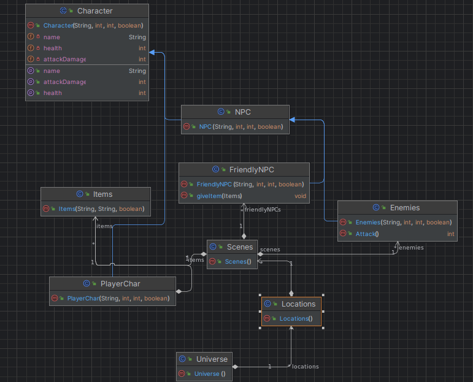

## Téma a vize projektu:
Whispering Woods: The Tree of Life
Svět už roky umírá, před spustou lety přišel vlk z dáli a od té doby sužuje celý stenající les. Otrávil
jeho vody a znehodnotil jeho zeminu, má tak totiž moc nad oním lesem, a může ho mučit, tak jako
jeho myšlenky na jeho ztracenou dcera, která zmizela v těchto lesích.
Mezi bytostmi, které obývají stenající les panuje legenda, ta praví, že jednoho dne má přijít
následník duší lesa, a ten má vlka vyhnat a navrátit lesu jeho sílu.
Jedné bouřlivé noci, sedí sova ve svém přístřešku, a vidí padat hvězdu, ta dopadne kousek od jejího
domu, rychle za ní utíká, všimne si, že se ale nejedná o hvězdu ale o duši, kterých tu bávalo kdysi
spousta, donese jí k sobě, kde jí nechá zotavit do dalšího dne. Duše se zatoulala z vedlejšího lesa a
nyní chce utéct, to ale nemůže všude se bodláky a schnilá voda, tak vyslechne si příběh od sovy a o
lese, a tak se rozhodne pomoci lesu, aby se mohla dostat domů. Vidí v jakém je stavu Les Života,
celý uschlý polomrtvý, a tak se ptá sovy co s tím, ta říká, že musí obnovit vodu a přinést lesu živiny.
Tak se hrdina vydává do Východní lesa, kde vyřeší dva puclíky pomocí, kterých získává madlo a
klacík, diký kterým vytvoří páčku na spuštění starého mlýna, díky kterému se obnoví tok vody, a
voda se stavá znovu pitná. Všimnou si toho místní bytosti. A ty mu poradí, že na začátku
východního lesa je jeskyně, kde je schovaný meč, hlavní hrdina si pro něho dojde a vyraží za sovou,
od té se dozví, že v západním lese jsou živiny, ty jsou rozdělené na tři častí. Hrdina je jde sebrat,
jsou zde ale jsou zde dva typy nepřátel. Velcí brouci co běží rychle, ale jsou neohrabaní a menší
komáři, který útočí rychle, ale rychle I umírají. Po získaní třech častí a jejich spojení. Hrdina obnoví
les, Toho si však všimne vlk a vezme jeho zachránce sovu, vyšplhá s ním na strom, kde ho chce
zabít. Dole mu v rychlosti jedno stvoření dá ohnivou kouli, kterou musí vlkovi dát do chřtánu, aby
ho zabil. Vyleze co nejrychleji nahoru přemůže vlka, nakonec ho ale nezabíjí, vlk si uvědomí svou
zaslepenost a utíká pryč z lesů a Stánající lés nabývá své staré krásy.

### Funkce:
 **Mapa**: 
Strom života uprostřed v levo Západní les, v Pravo Východní les.

**Východní les** – pět podsnímků – chodba, jeskyně, první hádanka, druhá hádanka, Mlýn.
Chodba cesta k ostatním lokacím, Jeskyně skrývá meč, hádanka jedna skrává madlo, hádanka dvě
skrýva kladcík. Ve mlýně díký páčce spustíme tok vody.

**Západní les** – čtyři podsnímky – chodba, skakací lokace, nepřítelská lokace, skakací lokace s
nepřáteli. V každé lokaci se získá jedna živina pro les.

**Nepřátelé** - jsou dvou typů, velcí neohrabaní brouci, běži a naráži do vás, pomalu se otačí , zabíjí vás na
dvě rány. Komáři, utočí rychle ale málo, zabijí vás na šest ran. Překáži budou bodláky, vyvíšené
platformy a propasti.

v pravo v inventáři. Mapa lesa Q.
Strom života – šest snímků, Hlavní snímek, Levá část, Pravá část. Vnitřek 1, Vnitřek 2, Vršek.
Hlavní snímek před stromem, Levá část vesta k západnímu lesu, pravá část cesta k východnímu
lesu. Vnitřek 1 + Vnitřek 2 možnost vyskákat nahoru. Vršek – boss fight místo.
Hlavní postava: pohyb WSAD, útok myš levý tlačítko. Inventář E, spojení pomocí „crafting table“
v pravo v inventáři. Mapa lesa Q.

**NPCs**: Sova, Bytosti lesa, Vlk, Komáři, Brouci,

### diagram:

